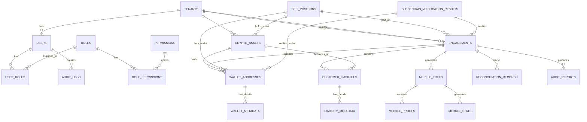

# SimplyFI Proof of Reserves Platform - Entity Relationship Diagram

## Database Schema Overview

This document describes the database schema for the SimplyFI PoR crypto audit platform using a Mermaid Entity Relationship Diagram.



## Table Definitions

### 1. TENANTS
Organization-level table for multi-tenancy support.

| Column | Type | Constraints | Description |
|--------|------|-------------|-------------|
| id | UUID | PK | Primary key |
| name | VARCHAR(255) | NOT NULL UNIQUE | Organization name (e.g., Kraken, FCA) |
| type | ENUM | NOT NULL | vasp, auditor, regulator |
| vara_license_number | VARCHAR(100) | UNIQUE | VARA license identifier |
| description | TEXT | | Organization description |
| logo_url | VARCHAR(500) | | Logo URL |
| status | ENUM | DEFAULT 'active' | active, inactive, suspended |
| settings | JSONB | | Configuration object |
| created_at | TIMESTAMP | NOT NULL DEFAULT NOW() | |
| updated_at | TIMESTAMP | NOT NULL DEFAULT NOW() | |

**Indexes:**
- idx_tenants_type ON (type)
- idx_tenants_status ON (status)
- idx_tenants_vara_license ON (vara_license_number)

---

### 2. USERS
User accounts across all tenants.

| Column | Type | Constraints | Description |
|--------|------|-------------|-------------|
| id | UUID | PK | Primary key |
| email | VARCHAR(255) | NOT NULL UNIQUE | User email |
| password_hash | VARCHAR(255) | NOT NULL | Bcrypt hash |
| first_name | VARCHAR(100) | NOT NULL | |
| last_name | VARCHAR(100) | NOT NULL | |
| avatar_url | VARCHAR(500) | | Profile picture |
| status | ENUM | DEFAULT 'active' | active, inactive, suspended |
| mfa_enabled | BOOLEAN | DEFAULT FALSE | MFA status |
| tenant_id | UUID | FK -> TENANTS | Organization membership |
| created_at | TIMESTAMP | NOT NULL DEFAULT NOW() | |
| updated_at | TIMESTAMP | NOT NULL DEFAULT NOW() | |
| last_login_at | TIMESTAMP | | Last login timestamp |

**Indexes:**
- idx_users_email ON (email)
- idx_users_tenant_id ON (tenant_id)
- idx_users_status ON (status)

---

### 3. ROLES
System and custom roles for RBAC.

| Column | Type | Constraints | Description |
|--------|------|-------------|-------------|
| id | UUID | PK | Primary key |
| name | VARCHAR(255) | NOT NULL UNIQUE | Role name (e.g., "Audit Manager") |
| type | ENUM | NOT NULL | system, custom |
| description | TEXT | | Role description |
| user_count | INTEGER | DEFAULT 0 | Number of users with role |
| created_at | TIMESTAMP | NOT NULL DEFAULT NOW() | |
| updated_at | TIMESTAMP | NOT NULL DEFAULT NOW() | |

**System Roles:**
- System Administrator
- Audit Manager
- Audit Senior
- Audit Junior
- VASP Compliance Officer
- VASP Treasury Manager
- Regulatory Supervisor

**Indexes:**
- idx_roles_type ON (type)

---

### 4. PERMISSIONS
Granular permissions for resources.

| Column | Type | Constraints | Description |
|--------|------|-------------|-------------|
| id | UUID | PK | Primary key |
| name | VARCHAR(255) | NOT NULL UNIQUE | Permission code |
| resource | VARCHAR(100) | NOT NULL | Resource type (users, engagements, etc.) |
| action | ENUM | NOT NULL | create, read, update, delete, export |
| description | TEXT | | Human-readable description |
| created_at | TIMESTAMP | NOT NULL DEFAULT NOW() | |

---

### 5. USER_ROLES
Junction table for user-to-role assignment.

| Column | Type | Constraints | Description |
|--------|------|-------------|-------------|
| id | UUID | PK | Primary key |
| user_id | UUID | FK -> USERS | |
| role_id | UUID | FK -> ROLES | |
| created_at | TIMESTAMP | NOT NULL DEFAULT NOW() | |

**Indexes:**
- idx_user_roles_user_id ON (user_id)
- idx_user_roles_role_id ON (role_id)

---

### 6. ROLE_PERMISSIONS
Junction table for role-to-permission assignment.

| Column | Type | Constraints | Description |
|--------|------|-------------|-------------|
| id | UUID | PK | Primary key |
| role_id | UUID | FK -> ROLES | |
| permission_id | UUID | FK -> PERMISSIONS | |
| created_at | TIMESTAMP | NOT NULL DEFAULT NOW() | |

**Indexes:**
- idx_role_permissions_role_id ON (role_id)

---

### 7. CRYPTO_ASSETS
Supported cryptocurrencies and tokens.

| Column | Type | Constraints | Description |
|--------|------|-------------|-------------|
| id | UUID | PK | Primary key |
| symbol | VARCHAR(20) | NOT NULL UNIQUE | Ticker (e.g., BTC, ETH) |
| name | VARCHAR(255) | NOT NULL | Full name |
| asset_type | ENUM | NOT NULL | tier_1, tier_2, tier_3 |
| blockchains | TEXT[] | NOT NULL | Supported blockchains |
| contract_addresses | JSONB | | Chain-specific contract addresses |
| decimals | INTEGER | DEFAULT 18 | Token decimal places |
| logo_url | VARCHAR(500) | | Logo URL |
| created_at | TIMESTAMP | NOT NULL DEFAULT NOW() | |

**Indexes:**
- idx_crypto_assets_symbol ON (symbol)
- idx_crypto_assets_asset_type ON (asset_type)
- idx_crypto_assets_blockchains ON (blockchains) USING GIN

---

### 8. ENGAGEMENTS
Audit engagements linking VASPs and auditors.

| Column | Type | Constraints | Description |
|--------|------|-------------|-------------|
| id | UUID | PK | Primary key |
| vasp_tenant_id | UUID | FK -> TENANTS | VASP being audited |
| auditor_tenant_id | UUID | FK -> TENANTS | Auditor performing audit |
| status | ENUM | NOT NULL | planning, data_collection, verification, reporting, completed |
| audit_date | DATE | NOT NULL | Snapshot date for PoR |
| engagement_type | ENUM | | full_audit, limited_scope, attestation |
| scope | JSONB | | Assets and blockchains in scope |
| notes | TEXT | | Engagement notes |
| total_assets_usd | DECIMAL(20,2) | | Total USD value of reserves |
| asset_count | INTEGER | | Number of asset types |
| wallet_count | INTEGER | | Number of wallets |
| customer_count | INTEGER | | Number of customers |
| reserve_ratio | DECIMAL(5,2) | | Latest reserve ratio % |
| created_at | TIMESTAMP | NOT NULL DEFAULT NOW() | |
| updated_at | TIMESTAMP | NOT NULL DEFAULT NOW() | |
| completed_at | TIMESTAMP | | When engagement completed |

**Indexes:**
- idx_engagements_status ON (status)
- idx_engagements_vasp_tenant_id ON (vasp_tenant_id)
- idx_engagements_auditor_tenant_id ON (auditor_tenant_id)
- idx_engagements_audit_date ON (audit_date)
- idx_engagements_created_at ON (created_at)

---

### 9. WALLET_ADDRESSES
Cryptocurrency wallet addresses for asset reserves.

| Column | Type | Constraints | Description |
|--------|------|-------------|-------------|
| id | UUID | PK | Primary key |
| engagement_id | UUID | FK -> ENGAGEMENTS | Associated engagement |
| address | VARCHAR(255) | NOT NULL | Wallet address |
| blockchain | VARCHAR(100) | NOT NULL | Blockchain network |
| asset_symbol | VARCHAR(20) | NOT NULL | Crypto asset |
| label | VARCHAR(255) | | Human-readable label |
| wallet_type | ENUM | | cold_storage, hot_wallet, custody, other |
| reported_balance | DECIMAL(38,18) | | Balance per VASP |
| on_chain_balance | DECIMAL(38,18) | | Verified on-chain balance |
| balance_usd | DECIMAL(20,2) | | USD value |
| variance | DECIMAL(8,4) | | % difference: (on_chain - reported) / reported |
| verified_at | TIMESTAMP | | When balance last verified |
| created_at | TIMESTAMP | NOT NULL DEFAULT NOW() | |

**Indexes:**
- idx_wallet_addresses_engagement_id ON (engagement_id)
- idx_wallet_addresses_blockchain ON (blockchain)
- idx_wallet_addresses_asset_symbol ON (asset_symbol)
- idx_wallet_addresses_address ON (address)

---

### 10. CUSTOMER_LIABILITIES
Customer account balances (liabilities to exchange).

| Column | Type | Constraints | Description |
|--------|------|-------------|-------------|
| id | UUID | PK | Primary key |
| engagement_id | UUID | FK -> ENGAGEMENTS | Associated engagement |
| customer_account_id | VARCHAR(255) | | Exchange's internal customer ID |
| customer_label | VARCHAR(255) | | Customer display name |
| asset_symbol | VARCHAR(20) | NOT NULL | Crypto asset |
| account_type | ENUM | | spot, margin, earning, staking, other |
| reported_balance | DECIMAL(38,18) | NOT NULL | Balance per VASP |
| balance_usd | DECIMAL(20,2) | | USD value |
| verified | BOOLEAN | DEFAULT FALSE | Whether verified |
| notes | TEXT | | Special notes |
| created_at | TIMESTAMP | NOT NULL DEFAULT NOW() | |

**Indexes:**
- idx_customer_liabilities_engagement_id ON (engagement_id)
- idx_customer_liabilities_customer_account_id ON (customer_account_id)
- idx_customer_liabilities_asset_symbol ON (asset_symbol)
- idx_customer_liabilities_verified ON (verified)

---

### 11. MERKLE_TREES
Merkle trees for customer balance verification.

| Column | Type | Constraints | Description |
|--------|------|-------------|-------------|
| id | UUID | PK | Primary key |
| engagement_id | UUID | FK -> ENGAGEMENTS | Associated engagement |
| root_hash | VARCHAR(255) | NOT NULL UNIQUE | Merkle root hash |
| leaf_count | INTEGER | NOT NULL | Number of customer records |
| tree_depth | INTEGER | | Tree depth |
| hash_algorithm | VARCHAR(50) | DEFAULT 'SHA256' | Hash function used |
| created_at | TIMESTAMP | NOT NULL DEFAULT NOW() | |
| updated_at | TIMESTAMP | NOT NULL DEFAULT NOW() | |

**Indexes:**
- idx_merkle_trees_engagement_id ON (engagement_id)

---

### 12. MERKLE_PROOFS
Individual Merkle proofs for customer balance verification.

| Column | Type | Constraints | Description |
|--------|------|-------------|-------------|
| id | UUID | PK | Primary key |
| merkle_tree_id | UUID | FK -> MERKLE_TREES | Associated tree |
| customer_id | VARCHAR(255) | NOT NULL | Customer identifier |
| balance | DECIMAL(38,18) | NOT NULL | Customer's total balance |
| leaf_index | INTEGER | | Index in tree |
| proof | TEXT[] | NOT NULL | Array of sibling hashes |
| created_at | TIMESTAMP | NOT NULL DEFAULT NOW() | |

**Indexes:**
- idx_merkle_proofs_merkle_tree_id ON (merkle_tree_id)
- idx_merkle_proofs_customer_id ON (customer_id)

---

### 13. RECONCILIATION_RECORDS
Daily reconciliation of reserves vs. liabilities.

| Column | Type | Constraints | Description |
|--------|------|-------------|-------------|
| id | UUID | PK | Primary key |
| engagement_id | UUID | FK -> ENGAGEMENTS | Associated engagement |
| date | DATE | NOT NULL | Reconciliation date |
| total_liability_usd | DECIMAL(20,2) | NOT NULL | Total customer liabilities |
| total_reserves_usd | DECIMAL(20,2) | NOT NULL | Total verified reserves |
| overall_ratio | DECIMAL(5,2) | NOT NULL | Reserves / Liabilities × 100 |
| created_at | TIMESTAMP | NOT NULL DEFAULT NOW() | |

**Indexes:**
- idx_reconciliation_records_engagement_id ON (engagement_id)
- idx_reconciliation_records_date ON (date)

---

### 14. DEFI_POSITIONS
DeFi positions verified for audits.

| Column | Type | Constraints | Description |
|--------|------|-------------|-------------|
| id | UUID | PK | Primary key |
| engagement_id | UUID | FK -> ENGAGEMENTS | Associated engagement |
| wallet_address | VARCHAR(255) | | Wallet holding position |
| protocol_name | VARCHAR(255) | | DeFi protocol (Aave, Lido, etc.) |
| position_type | ENUM | | lending, borrowing, liquidity_pool, staking |
| blockchain | VARCHAR(100) | | Blockchain network |
| asset_symbol | VARCHAR(20) | | Asset in position |
| balance | DECIMAL(38,18) | | Position balance |
| balance_usd | DECIMAL(20,2) | | USD value |
| apy_percentage | DECIMAL(8,4) | | Annual percentage yield |
| verified | BOOLEAN | DEFAULT FALSE | Verification status |
| verified_at | TIMESTAMP | | When verified |
| created_at | TIMESTAMP | NOT NULL DEFAULT NOW() | |

---

### 15. AUDIT_REPORTS
Generated audit reports.

| Column | Type | Constraints | Description |
|--------|------|-------------|-------------|
| id | UUID | PK | Primary key |
| engagement_id | UUID | FK -> ENGAGEMENTS | Associated engagement |
| report_type | ENUM | | por, assurance, management_letter, customer_summary |
| status | ENUM | DEFAULT 'draft' | draft, in_review, finalized, issued |
| title | VARCHAR(500) | | Report title |
| summary | TEXT | | Executive summary |
| file_url | VARCHAR(500) | | S3/storage URL |
| pages | INTEGER | | Page count |
| created_by | UUID | FK -> USERS | Creator user |
| created_at | TIMESTAMP | NOT NULL DEFAULT NOW() | |
| updated_at | TIMESTAMP | NOT NULL DEFAULT NOW() | |

---

### 16. AUDIT_LOGS
System audit trail for compliance.

| Column | Type | Constraints | Description |
|--------|------|-------------|-------------|
| id | UUID | PK | Primary key |
| user_id | UUID | FK -> USERS | Actor user |
| user_email | VARCHAR(255) | | User's email at time of action |
| action | ENUM | | create, read, update, delete, export, verify, generate |
| resource_type | VARCHAR(100) | | Type of resource (engagements, users, etc.) |
| resource_id | UUID | | ID of affected resource |
| details | JSONB | | Additional context |
| ip_address | VARCHAR(45) | | IPv4/IPv6 address |
| user_agent | TEXT | | Browser user agent |
| status | ENUM | | success, failure |
| timestamp | TIMESTAMP | NOT NULL DEFAULT NOW() | |

**Indexes:**
- idx_audit_logs_user_id ON (user_id)
- idx_audit_logs_resource_type ON (resource_type)
- idx_audit_logs_action ON (action)
- idx_audit_logs_status ON (status)
- idx_audit_logs_timestamp ON (timestamp)

---

## Key Relationships

### 1. Multi-Tenancy
```
TENANTS (1)
├─ USERS (many) - Users belong to tenant
├─ ENGAGEMENTS (many) - Both VASP and auditor relationships
└─ CRYPTO_ASSETS (many) - Supported assets per tenant
```

### 2. Role-Based Access Control
```
USERS (many) --> USER_ROLES (many) <-- ROLES (many)
                                          └─ ROLE_PERMISSIONS (many)
                                             └─ PERMISSIONS (many)
```

### 3. Audit Engagement Flow
```
ENGAGEMENTS (1)
├─ WALLET_ADDRESSES (many) - Reserve wallets
├─ CUSTOMER_LIABILITIES (many) - Customer balances
├─ MERKLE_TREES (1) - Balance verification tree
│  └─ MERKLE_PROOFS (many) - Individual proofs
├─ RECONCILIATION_RECORDS (many) - Daily reconciliation
├─ DEFI_POSITIONS (many) - DeFi holdings
└─ AUDIT_REPORTS (many) - Generated reports
```

### 4. Cryptocurrency Holdings
```
CRYPTO_ASSETS (1)
├─ WALLET_ADDRESSES (many) - Where asset is held
└─ CUSTOMER_LIABILITIES (many) - Customer exposure
```

## Data Constraints and Validation

### Status Enums
- **Engagement Status:** planning → data_collection → verification → reporting → completed
- **User Status:** active, inactive, suspended
- **Tenant Status:** active, inactive, suspended
- **Report Status:** draft → in_review → finalized → issued
- **Asset Type:** tier_1 (major), tier_2 (significant), tier_3 (other)

### Business Rules
1. A completed engagement must have a reserve_ratio ≥ 100.0
2. Wallet addresses must have a valid blockchain and asset_symbol
3. Customer liabilities total must match reserve verification
4. Merkle tree root_hash must be unique per engagement
5. Reconciliation records must be created daily during audit
6. Audit logs are immutable (no updates allowed)
7. Reserve ratio = (Total Reserves USD / Total Liabilities USD) × 100

## Performance Considerations

### Indexing Strategy
- **Lookup Indexes:** user_id, tenant_id, engagement_id for fast joins
- **Filter Indexes:** status, asset_type, blockchain for WHERE clauses
- **GIN Indexes:** blockchains array for efficient blockchain filtering
- **Range Indexes:** created_at, audit_date for time-based queries

### Query Optimization
- Partition large tables (CUSTOMER_LIABILITIES, WALLET_ADDRESSES) by engagement_id
- Archive old reconciliation records to separate table after 90 days
- Use materialized views for reserve ratio calculations
- Cache Merkle tree statistics in denormalized column

## Security Considerations

1. **Sensitive Data:**
   - Password hashes use bcrypt with cost factor ≥ 12
   - Private keys never stored in database
   - Wallet addresses checksummed and validated

2. **Audit Trail:**
   - All changes logged to AUDIT_LOGS with immutable timestamp
   - User email captured at time of action
   - IP address and user agent recorded for forensics

3. **Access Control:**
   - All access controlled through role/permission system
   - Tenant isolation enforced at application layer
   - Regulatory users can see only assigned tenants

4. **Data Integrity:**
   - Decimal types for all financial values (never float)
   - UUID primary keys prevent ID enumeration
   - Foreign key constraints enforce referential integrity

---

**Last Updated:** 2024-02-27
**Schema Version:** 1.0.0
