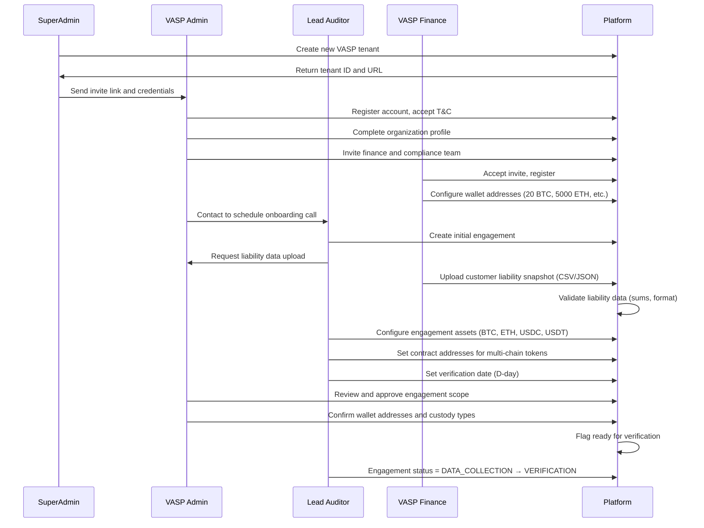
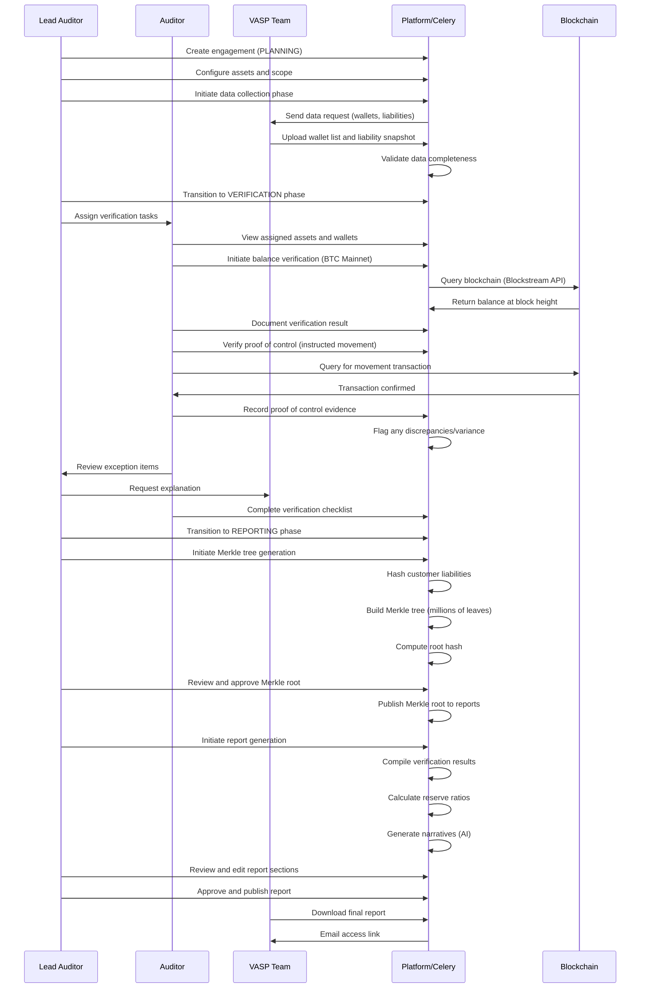
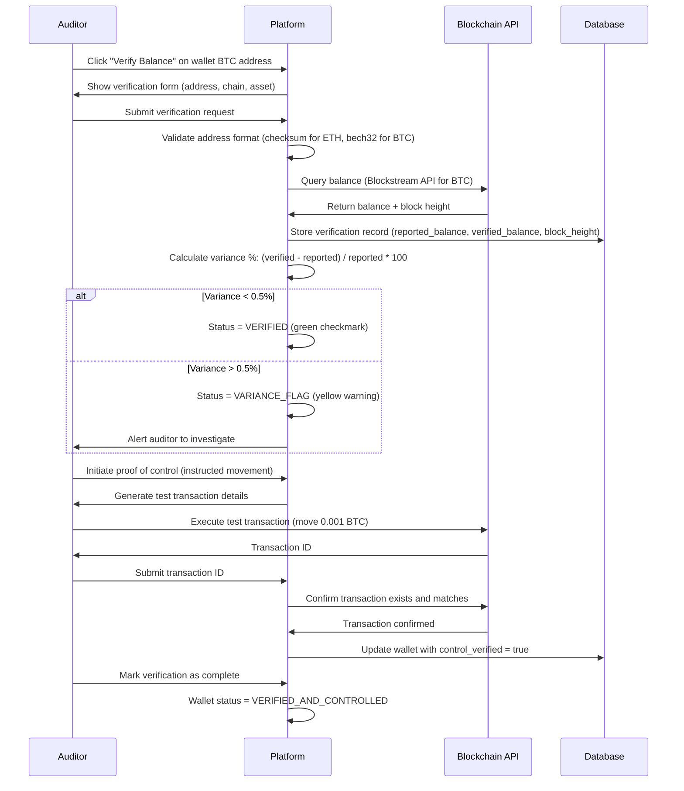
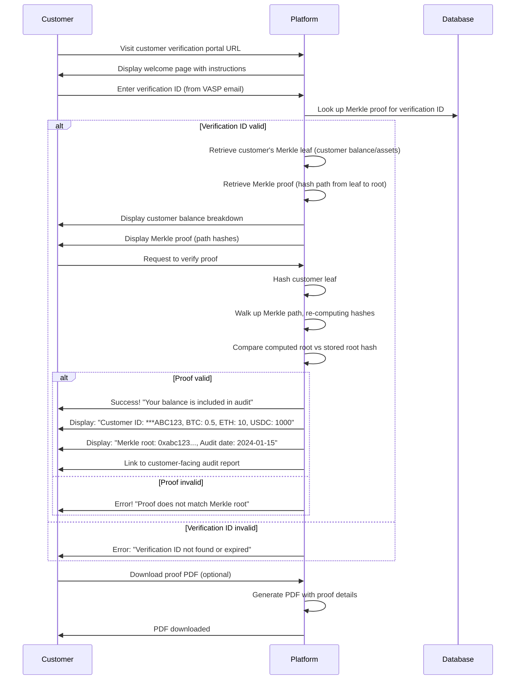
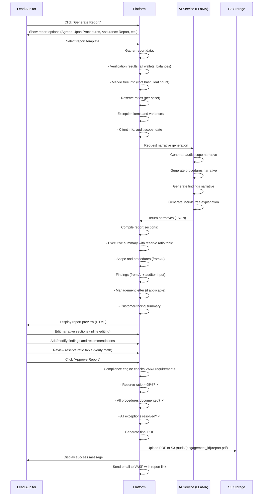
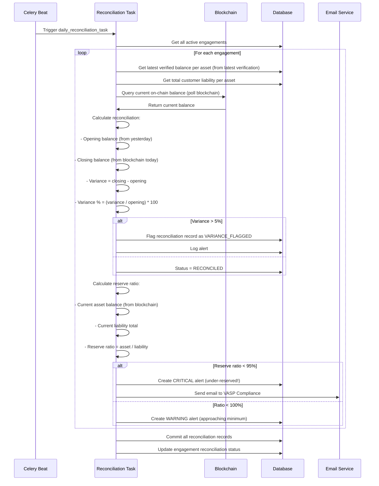
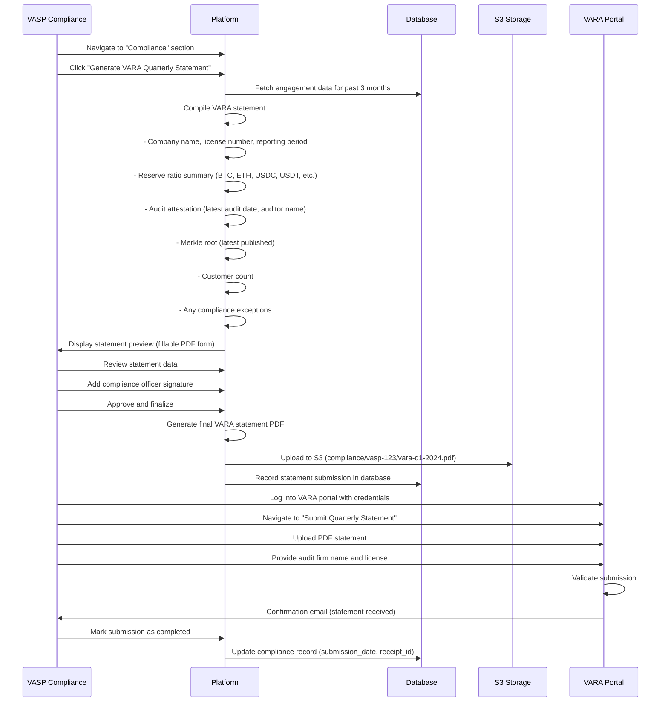
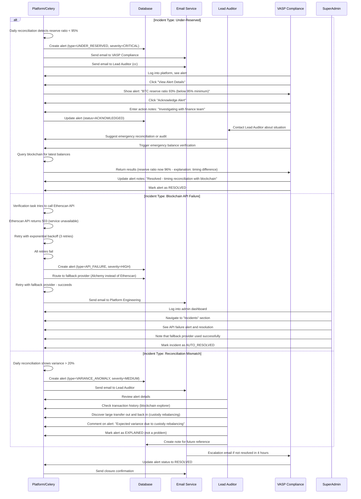

# SimplyFI PoR Platform: Personas & User Journeys

**Document Version**: 1.0
**Last Updated**: February 2026
**Target Audience**: Product, Engineering, QA, UX/UI Teams

---

## Table of Contents

1. [User Personas](#user-personas)
2. [Permission Matrix](#permission-matrix)
3. [User Journeys & Workflows](#user-journeys--workflows)
4. [Integration Points & API Flows](#integration-points--api-flows)

---

## User Personas

The SimplyFI PoR platform serves 8 distinct user personas, each with unique objectives, responsibilities, and access patterns. Below is a comprehensive mapping of each role.

### 1. SuperAdmin (Platform Administrator)

**Role Code**: `SUPER_ADMIN`

**Primary Objectives**:
- Manage multi-tenant environments
- Provision and deprovision organizations
- Configure system-wide settings and compliance rules
- Oversee all platform operations and security
- Monitor system health and resource utilization
- Manage audit logs and data governance

**Responsibilities**:
- User & tenant lifecycle management (create, suspend, delete)
- Role and permission configuration across all tenants
- Integration setup (blockchain APIs, third-party services)
- Security policy enforcement (MFA, password requirements, IP whitelisting)
- Data retention and backup policy management
- Incident escalation and system-level troubleshooting
- Regulatory compliance dashboard monitoring
- API key and credential rotation

**Access Level**: `UNRESTRICTED`

**Permission Categories**:
- `tenants:*` - Full CRUD on all tenants
- `users:*` - Full user management across all organizations
- `roles:*` - Custom role creation and modification
- `system:*` - System configuration and maintenance
- `compliance:*` - Global compliance and audit controls
- `reports:*` - Access to all reports across all tenants
- `settings:*` - Configure global platform settings

**Primary Use Cases**:
1. Onboard new VASP client organization
2. Invite auditor team members and assign roles
3. Configure VARA compliance level and reserve ratio requirements
4. Monitor platform health and performance metrics
5. Review audit logs for security and compliance
6. Rotate API keys and manage integrations
7. Manage data retention and backup schedules

**Key Screens/Pages**:
- **Admin Dashboard**: System health, tenant overview, alert summary
- **Tenant Management**: CRUD operations, license management, status tracking
- **User Administration**: User list, role assignment, MFA enforcement
- **System Settings**: API keys, blockchain endpoints, SMTP configuration
- **Audit Log Viewer**: All platform activity, filtering by user/resource/action
- **Compliance Dashboard**: VARA status, reserve ratio trends, risk alerts
- **Backup & Recovery**: Point-in-time restore, data export
- **Integration Manager**: Third-party service configuration, health status

**Integration Touchpoints**:
- Direct database access (PostgreSQL superuser equivalent)
- All REST API endpoints with `*` permissions
- Celery task monitoring (Redis broker inspection)
- Kubernetes cluster access (if deployed on K8s)
- Cloud infrastructure (AWS IAM, S3, CloudWatch)

---

### 2. Lead Auditor (Senior Auditor at SimplyFI)

**Role Code**: `LEAD_AUDITOR`

**Primary Objectives**:
- Manage audit engagements from initiation to completion
- Assign work to junior auditors and review their findings
- Sign off on final audit reports and attestations
- Ensure quality and regulatory compliance of all reports
- Interface with VASP clients on findings and recommendations
- Maintain audit documentation and manage engagement timelines

**Responsibilities**:
- Create and plan new audit engagements
- Define audit scope, timeline, and resource requirements
- Assign tasks to junior auditors and field team members
- Review on-chain verification results and exception analysis
- Approve Merkle tree generation and customer liability verification
- Validate reserve ratio calculations and variance analysis
- Review and approve final audit reports before publication
- Communicate findings to VASP compliance officers
- Document management letter items and recommendations
- Schedule follow-up audits and manage recurring engagements

**Access Level**: `TEAM_SCOPED` (can see all engagements managed by SimplyFI)

**Permission Categories**:
- `engagements:create` - Create new audit engagements
- `engagements:read:all` - View all SimplyFI-managed engagements
- `engagements:update:own` - Update own engagements
- `engagements:approve` - Approve reports and sign-off
- `assets:read` - View asset configuration and balances
- `verification:read` - Access all on-chain verification results
- `merkle:read` - View Merkle tree generation and proofs
- `reports:create` - Generate audit reports
- `reports:approve` - Approve and publish reports
- `users:read:team` - View team member list and assignments

**Primary Use Cases**:
1. Create new audit engagement for VASP client
2. Configure assets to audit (BTC, ETH, USDC, etc.)
3. Import wallet addresses and customer liability data
4. Initiate on-chain balance verification procedures
5. Generate Merkle tree for customer liability verification
6. Review and approve Merkle root hash
7. Validate reserve ratio meets VARA requirements (≥95%)
8. Review exception reports and variance analysis
9. Approve and publish final audit report
10. Create management letter with findings and recommendations
11. Export VARA quarterly compliance statement

**Key Screens/Pages**:
- **Engagement Dashboard**: List of active/completed engagements, timeline view
- **Engagement Details**: Client info, assets, wallet list, status tracker
- **Asset Configuration**: Asset selection, contract address management, tier assignment
- **Data Import**: Wallet addresses, customer liability data, bulk upload
- **On-Chain Verification**: Verification status, balance results, proof of control
- **Merkle Tree Editor**: Tree visualization, leaf management, root hash display
- **Report Builder**: Template selection, narrative editing, section approval
- **Sign-Off Panel**: Review checklist, audit completion form, publication controls
- **Customer Verification Portal**: Preview of customer-facing portal
- **Team Management**: Assign auditors to engagement, track progress

**Integration Touchpoints**:
- `POST /api/v1/engagements` - Create new engagement
- `PUT /api/v1/engagements/{id}` - Update engagement status
- `POST /api/v1/engagements/{id}/assets` - Add assets to audit
- `POST /api/v1/blockchain/verify-balance` - Initiate verification
- `POST /api/v1/merkle/generate-tree` - Generate Merkle tree
- `PUT /api/v1/merkle/approve-root` - Approve Merkle root
- `POST /api/v1/reports/generate` - Generate report
- `PUT /api/v1/reports/{id}/approve` - Approve and publish report
- `POST /api/v1/users/assign-role` - Assign auditors to engagement

---

### 3. Auditor (Field Auditor/Verification Specialist)

**Role Code**: `AUDITOR`

**Primary Objectives**:
- Perform on-chain verification procedures
- Verify proof of control over wallet addresses
- Analyze blockchain transactions and balances
- Support Merkle tree generation process
- Document verification findings and exceptions
- Respond to review comments from lead auditors

**Responsibilities**:
- Execute blockchain balance verification for assigned assets
- Query blockchain adapters (Etherscan, Blockstream, Solana RPC)
- Verify proof of control through transaction analysis
- Document verification methodology and results
- Flag discrepancies and variance analysis
- Assist with customer liability data validation
- Prepare exception reports for lead auditor review
- Conduct DeFi position verification and risk assessment
- Monitor reconciliation results and variance trends
- Perform post-verification data quality checks

**Access Level**: `ENGAGEMENT_SCOPED` (can only see assigned engagements)

**Permission Categories**:
- `engagements:read:assigned` - View assigned engagements
- `assets:read` - View asset configuration
- `verification:execute` - Initiate blockchain verification
- `verification:read:own` - View own verification results
- `merkle:read` - View Merkle tree data (read-only)
- `reports:read:own` - View reports for assigned engagement
- `blockchain:query` - Query blockchain adapters
- `defi:verify` - Verify DeFi positions

**Primary Use Cases**:
1. View assigned verification tasks in engagement
2. Query blockchain to verify wallet balance (BTC UTXO, ETH state, etc.)
3. Document verification method and block height timestamp
4. Perform proof of control verification (instructed movement)
5. Analyze blockchain transactions for anomalies
6. Verify DeFi positions (Aave, Uniswap, staking)
7. Flag discrepancies and request lead auditor review
8. Monitor daily reconciliation results
9. Prepare variance analysis report
10. Submit findings for management letter inclusion

**Key Screens/Pages**:
- **My Engagements**: Assigned engagements and verification tasks
- **Verification Checklist**: List of assets to verify, completion status
- **Blockchain Explorer**: Query interface for balance verification
- **Transaction Analyzer**: Proof of control documentation, anomaly detection
- **Verification Results**: Balance snapshot, variance %, blockchain reference
- **DeFi Position Verifier**: Protocol analysis, position breakdown, risk scoring
- **Reconciliation Dashboard**: Daily/weekly variance trends, alert list
- **Exception Report**: Flag discrepancies, request lead auditor review
- **My Tasks**: Assigned verification tasks, deadlines, priority

**Integration Touchpoints**:
- `POST /api/v1/blockchain/verify-balance` - Execute balance verification
- `GET /api/v1/blockchain/{chain}/balance/{address}` - Query balance
- `POST /api/v1/blockchain/verify-control` - Verify proof of control
- `GET /api/v1/blockchain/{chain}/transaction/{tx_hash}` - Get tx details
- `POST /api/v1/defi/verify-position` - Verify DeFi position
- `GET /api/v1/engagements/{id}/verification-status` - Check status
- `POST /api/v1/exceptions/flag` - Flag discrepancy
- `GET /api/v1/reconciliation/{engagement_id}` - View reconciliation

---

### 4. VASP Admin (Exchange/VASP Organization Admin)

**Role Code**: `VASP_ADMIN`

**Primary Objectives**:
- Manage VASP organization and team structure
- Configure wallet addresses and custody arrangements
- Oversee audit engagement coordination with SimplyFI
- Approve audit scope and engagement timeline
- Manage VASP compliance officer access
- Serve as primary contact for audit team

**Responsibilities**:
- Invite and manage VASP team members (finance, compliance)
- Configure wallet address details (custody type, verification)
- Upload customer liability data securely
- Review and approve audit scope before engagement start
- Coordinate with Simon (Lead Auditor) on timeline and resources
- Manage wallet updates (new addresses, changes in custody)
- Review preliminary findings and respond to audit queries
- Approve final audit scope and reserve ratio methodology
- Schedule follow-up audits and engagements
- Update organization settings and security policies

**Access Level**: `TENANT_SCOPED` (can only see own VASP organization)

**Permission Categories**:
- `engagements:read:own` - View own organization's engagements
- `engagements:update:own` - Update own engagements (limited fields)
- `users:manage:org` - Invite and manage VASP team members
- `wallets:manage` - Add/update/verify wallet addresses
- `assets:read` - View asset configuration
- `reports:read:own` - View reports for own engagements
- `liabilities:upload` - Upload customer liability data
- `settings:manage:org` - Update organization settings

**Primary Use Cases**:
1. Invite finance and compliance team members to VASP organization
2. Add new wallet address with custody type information
3. Update wallet verification status (cold storage, exchange, custodian)
4. Upload monthly customer liability snapshots
5. Configure audit scope (which assets, blockchains, liability data)
6. Review and approve audit engagement timeline
7. Respond to auditor data requests and clarification questions
8. Review preliminary verification results
9. Approve final reserve ratio calculations
10. Schedule next audit or compliance engagement
11. Configure webhook notifications for Merkle root changes

**Key Screens/Pages**:
- **Organization Dashboard**: Quick stats, audit calendar, engagement status
- **Team Management**: Invite members, manage roles, revoke access
- **Wallet Management**: Add/edit/verify wallet addresses, custody type
- **Liability Data Upload**: Bulk upload interface, validation preview, history
- **Engagement Details**: Audit scope, timeline, status tracker
- **Preliminary Results**: Verification status, reserve ratio draft, variance summary
- **Audit Communication**: Messages from audit team, clarification requests
- **Reports**: Access to finalized reports, export options
- **Organization Settings**: Company info, notification preferences, security policies

**Integration Touchpoints**:
- `POST /api/v1/users/invite` - Invite team members
- `POST /api/v1/wallets` - Add wallet address
- `PUT /api/v1/wallets/{id}` - Update wallet
- `POST /api/v1/liabilities/upload` - Upload liability data
- `GET /api/v1/engagements/{id}` - View engagement details
- `PUT /api/v1/engagements/{id}` - Update engagement (limited)
- `POST /api/v1/engagements/{id}/approve` - Approve engagement
- `GET /api/v1/reports/{id}` - Download report

---

### 5. VASP Finance (Finance Team Member at VASP)

**Role Code**: `VASP_FINANCE`

**Primary Objectives**:
- Maintain accurate wallet balances and asset inventory
- Monitor reserve status and liquidity position
- Report on asset allocation and custody arrangements
- Coordinate with auditors on balance verification
- Track asset movements and reconciliation

**Responsibilities**:
- Update wallet address list as new custody added/removed
- Provide customer liability data (balance snapshots)
- Verify blockchain balance queries with internal records
- Explain any discrepancies or variance in balances
- Report on daily/weekly asset reconciliation
- Coordinate with custodians on balance confirmations
- Document proof of control procedures
- Maintain asset custody documentation
- Monitor DeFi position movements and yield accrual
- Provide market price data and valuation inputs

**Access Level**: `TENANT_SCOPED` (read-only for most items, write for own data)

**Permission Categories**:
- `engagements:read:own` - View organization's engagements
- `wallets:read` - View wallet list and addresses
- `assets:read` - View asset configuration
- `balances:read` - View reported and verified balances
- `liabilities:read` - View liability data
- `verification:read` - View verification results (read-only)
- `reconciliation:read` - View reconciliation reports

**Primary Use Cases**:
1. Review reported wallet balances before audit
2. Coordinate balance verification with blockchain queries
3. Provide custody documentation and proof of control evidence
4. Explain balance movements or custody changes
5. Support DeFi position verification (yield, LP positions)
6. Provide customer liability snapshot file
7. Review preliminary reserve ratio results
8. Support variance analysis explanation
9. Monitor daily reconciliation variance
10. Respond to auditor balance inquiry requests

**Key Screens/Pages**:
- **Dashboard**: Asset overview, balance summary, reserve ratio snapshot
- **Wallet Inventory**: Wallet addresses, custody types, balance tracking
- **Balance Verification**: Reported vs verified balance comparison, variance %
- **DeFi Positions**: Position list, principal/rewards breakdown, risk exposure
- **Liability Overview**: Total liabilities, customer count, balance trend
- **Reconciliation Status**: Daily variance, trends, anomaly flags
- **Reports**: Engagement reports, balance confirmation letters
- **Audit Coordination**: Pending auditor questions, response requirements

**Integration Touchpoints**:
- `GET /api/v1/wallets` - List wallets
- `GET /api/v1/assets` - View assets
- `GET /api/v1/balances/{engagement_id}` - View balance summary
- `GET /api/v1/blockchain/verify-balance/{address}` - Verify balance
- `GET /api/v1/defi/positions` - View DeFi positions
- `GET /api/v1/liabilities` - View liability data
- `GET /api/v1/reports/{id}` - View engagement report

---

### 6. VASP Compliance (Compliance Officer at VASP)

**Role Code**: `VASP_COMPLIANCE`

**Primary Objectives**:
- Ensure compliance with VARA reserve requirements
- Review and approve audit reports and findings
- Manage regulatory reporting and submissions
- Oversee management letter recommendations
- Maintain compliance documentation
- Escalate compliance issues to senior management

**Responsibilities**:
- Review final audit reports for reserve ratio compliance
- Monitor reserve ratio trending and adequacy
- Review management letter findings and observations
- Prepare quarterly VARA compliance statements
- Submit attestations to VARA or regulatory bodies
- Maintain audit file and engagement documentation
- Escalate under-reserve conditions to management
- Coordinate remedial actions for findings
- Document compliance improvements and monitoring
- Prepare regulatory correspondence and responses

**Access Level**: `TENANT_SCOPED` (can read all engagement data)

**Permission Categories**:
- `engagements:read:own` - View organization's engagements
- `reports:read:own` - Read all reports
- `reports:approve` - Approve reports (limited)
- `compliance:read` - View VARA compliance dashboard
- `alerts:acknowledge` - Acknowledge compliance alerts
- `attestations:create` - Create VARA attestations
- `liabilities:read` - View liability data
- `wallets:read` - View wallet configuration

**Primary Use Cases**:
1. Review final audit report before publication
2. Verify reserve ratio meets VARA minimum (≥95%)
3. Review management letter findings and recommendations
4. Prepare quarterly VARA reserve ratio statement
5. Generate VARA compliance attestation for regulators
6. Monitor ongoing reserve ratio from daily reconciliation
7. Escalate under-reserve conditions to executive team
8. Document remedial actions for findings
9. Maintain audit engagement documentation file
10. Prepare regulatory correspondence (VARA submissions, etc.)
11. Track management letter recommendation closure

**Key Screens/Pages**:
- **Compliance Dashboard**: Reserve ratio trend, VARA requirement status, alerts
- **Report Review**: Final report content, management letter, findings summary
- **VARA Statement Generator**: Quarterly statement builder, signature controls
- **Attestation Management**: Create/review/submit VARA attestations
- **Ongoing Monitoring**: Daily reserve ratio, reconciliation variance, anomalies
- **Findings Management**: Management letter items, remediation tracking
- **Regulatory Calendar**: Audit schedule, VARA submission deadlines
- **Document Archive**: All audit reports, attestations, correspondence

**Integration Touchpoints**:
- `GET /api/v1/engagements/{id}` - View engagement
- `GET /api/v1/reports/{id}` - Download report
- `GET /api/v1/compliance/vara-statement` - Generate VARA statement
- `POST /api/v1/compliance/attestation` - Create attestation
- `GET /api/v1/reconciliation/{engagement_id}` - View reconciliation
- `POST /api/v1/alerts/acknowledge` - Acknowledge alert
- `GET /api/v1/reports/{id}/findings` - View findings

---

### 7. Customer (End Customer of the VASP)

**Role Code**: `CUSTOMER`

**Primary Objectives**:
- Verify personal asset balances in the VASP
- Understand proof of reserves audit results
- Verify Merkle tree proof independently
- Build confidence in VASP reserve adequacy
- Access customer-facing audit summary

**Responsibilities**:
- Participate in liability data collection (customer account balance)
- Verify personal balance in Merkle proof (optional)
- Review customer-facing audit report
- Understand reserve ratio and audit methodology
- Report any balance discrepancies

**Access Level**: `SELF_SCOPED` (can only verify own data)

**Permission Categories**:
- `merkle:verify` - Verify own Merkle proof
- `reports:read:summary` - Read customer-facing report summary
- `balance:verify` - Verify own balance in Merkle tree

**Primary Use Cases**:
1. Receive Merkle root hash and verification link from VASP
2. Enter verification ID or customer ID
3. System retrieves customer's Merkle proof
4. Verify Merkle path from leaf to root hash
5. Display balance and asset breakdown
6. Show proof is valid and included in audit
7. Link to customer-facing audit report summary
8. Export proof for personal records

**Key Screens/Pages**:
- **Merkle Verification Portal**: Entry form, verification process, proof display
- **Balance Verification Result**: Customer balance, assets held, proof validity
- **Audit Summary**: Reserve ratio overview, audit scope, auditor attestation
- **Proof Details**: Merkle path, root hash, verification timestamp

**Integration Touchpoints**:
- `GET /api/v1/merkle/verify` - Retrieve and verify Merkle proof
- `POST /api/v1/merkle/verify` - Submit verification request
- `GET /api/v1/reports/{id}/customer-summary` - Get customer-facing summary

---

### 8. Regulator (VARA or Regulatory Authority)

**Role Code**: `REGULATOR`

**Primary Objectives**:
- Review VARA compliance and audit attestations
- Monitor reserve ratio adequacy across regulated VASPs
- Access audit reports and evidence
- Assess compliance effectiveness
- Maintain oversight dashboard

**Responsibilities**:
- Review quarterly compliance statements from VASPs
- Validate audit firm attestations and credentials
- Access underlying audit working papers (limited)
- Monitor reserve ratio trends across portfolio
- Escalate compliance concerns to VASP management
- Maintain regulatory file on VASP
- Prepare regulatory reports on market compliance
- Conduct periodic compliance examinations

**Access Level**: `READ_ONLY_CROSS_TENANT` (can read VARA-related data for all VASPs)

**Permission Categories**:
- `compliance:read:all` - Read all VARA compliance statements
- `attestations:read:all` - Review all attestations
- `reports:read:audit-scope` - Read audit scope and methodology
- `reserve-ratios:read:all` - View reserve ratio data
- `alerts:view:all` - View system-wide compliance alerts
- `vasp:read:regulated` - Read VASP registration and status

**Primary Use Cases**:
1. Log into VARA dashboard
2. View all licensed VASPs and compliance status
3. Download quarterly compliance statements
4. Review audit firm attestations
5. Access audit scope and methodology
6. View reserve ratio trend for each VASP
7. Monitor system-wide reserve adequacy
8. Escalate compliance concerns
9. Prepare regulatory reports
10. Export compliance data for analytics

**Key Screens/Pages**:
- **Regulator Dashboard**: VASP portfolio, compliance status, alert summary
- **VASP Detail**: Compliance status, reserve ratio trend, audit history
- **Compliance Statement Viewer**: VARA quarterly statements, signatures, attachments
- **Attestation Review**: Audit firm details, audit scope, attestation date
- **Reserve Ratio Analytics**: Trend chart, minimum requirement line, flagged entities
- **Alert Management**: Under-reserve alerts, audit delays, findings tracking
- **Regulatory Reports**: Export compliance data, analytics, trend reporting

**Integration Touchpoints**:
- `GET /api/v1/compliance/vara-statements` - List all statements
- `GET /api/v1/compliance/attestations` - List all attestations
- `GET /api/v1/reserve-ratios/trending` - View reserve ratio trends
- `GET /api/v1/alerts/compliance` - View compliance alerts
- `GET /api/v1/vasp/registered` - List regulated VASPs
- `GET /api/v1/reports/audit-scope` - View audit scopes

---

## Permission Matrix

| Resource | Action | SuperAdmin | Lead Auditor | Auditor | VASP Admin | VASP Finance | VASP Compliance | Customer | Regulator |
|----------|--------|:----:|:---:|:---:|:----:|:---:|:---:|:---:|:---:|
| **TENANTS** | Create | ✓ | ✗ | ✗ | ✗ | ✗ | ✗ | ✗ | ✗ |
| | Read All | ✓ | ✗ | ✗ | ✗ | ✗ | ✗ | ✗ | ✗ |
| | Update | ✓ | ✗ | ✗ | ✓* | ✗ | ✗ | ✗ | ✗ |
| | Delete | ✓ | ✗ | ✗ | ✗ | ✗ | ✗ | ✗ | ✗ |
| **USERS** | Create (Org) | ✓ | ✗ | ✗ | ✓ | ✗ | ✗ | ✗ | ✗ |
| | Read | ✓ | ✓ | ✗ | ✓ | ✗ | ✓ | ✗ | ✗ |
| | Update | ✓ | ✓* | ✗ | ✓* | ✗ | ✗ | ✗ | ✗ |
| | Delete | ✓ | ✗ | ✗ | ✓* | ✗ | ✗ | ✗ | ✗ |
| **ENGAGEMENTS** | Create | ✓ | ✓ | ✗ | ✗ | ✗ | ✗ | ✗ | ✗ |
| | Read | ✓ | ✓ | ✓* | ✓ | ✓* | ✓ | ✗ | ✗ |
| | Update | ✓ | ✓ | ✗ | ✓* | ✗ | ✗ | ✗ | ✗ |
| | Approve | ✓ | ✓ | ✗ | ✗ | ✗ | ✓* | ✗ | ✗ |
| | Delete | ✓ | ✓ | ✗ | ✗ | ✗ | ✗ | ✗ | ✗ |
| **ASSETS** | Create | ✓ | ✓ | ✗ | ✗ | ✗ | ✗ | ✗ | ✗ |
| | Read | ✓ | ✓ | ✓ | ✓ | ✓ | ✓ | ✗ | ✗ |
| | Update | ✓ | ✓ | ✗ | ✓* | ✗ | ✗ | ✗ | ✗ |
| | Delete | ✓ | ✓ | ✗ | ✗ | ✗ | ✗ | ✗ | ✗ |
| **WALLETS** | Create | ✓ | ✓ | ✗ | ✓ | ✗ | ✗ | ✗ | ✗ |
| | Read | ✓ | ✓ | ✓ | ✓ | ✓ | ✓ | ✗ | ✗ |
| | Update | ✓ | ✓ | ✗ | ✓ | ✗ | ✗ | ✗ | ✗ |
| | Delete | ✓ | ✓ | ✗ | ✓ | ✗ | ✗ | ✗ | ✗ |
| **LIABILITIES** | Upload | ✓ | ✓ | ✗ | ✓ | ✗ | ✗ | ✗ | ✗ |
| | Read | ✓ | ✓ | ✗ | ✓ | ✓ | ✓ | ✗ | ✗ |
| | Delete | ✓ | ✓ | ✗ | ✗ | ✗ | ✗ | ✗ | ✗ |
| **VERIFICATION** | Execute | ✓ | ✓ | ✓ | ✗ | ✗ | ✗ | ✗ | ✗ |
| | Read Results | ✓ | ✓ | ✓ | ✓ | ✓ | ✓ | ✗ | ✗ |
| **MERKLE** | Generate | ✓ | ✓ | ✗ | ✗ | ✗ | ✗ | ✗ | ✗ |
| | Approve Root | ✓ | ✓ | ✗ | ✗ | ✗ | ✗ | ✗ | ✗ |
| | Verify (Customer) | ✓ | ✓ | ✗ | ✓ | ✗ | ✗ | ✓ | ✗ |
| **REPORTS** | Create | ✓ | ✓ | ✗ | ✗ | ✗ | ✗ | ✗ | ✗ |
| | Read | ✓ | ✓ | ✓* | ✓ | ✓ | ✓ | ✓** | ✓ |
| | Approve | ✓ | ✓ | ✗ | ✗ | ✗ | ✓* | ✗ | ✗ |
| | Publish | ✓ | ✓ | ✗ | ✗ | ✗ | ✗ | ✗ | ✗ |
| | Export | ✓ | ✓ | ✓* | ✓ | ✓ | ✓ | ✗ | ✓ |
| **COMPLIANCE** | Read | ✓ | ✓ | ✗ | ✗ | ✗ | ✓ | ✗ | ✓ |
| | Create Attestation | ✓ | ✓ | ✗ | ✗ | ✗ | ✓ | ✗ | ✗ |
| | Manage Config | ✓ | ✗ | ✗ | ✗ | ✗ | ✗ | ✗ | ✗ |
| **ALERTS** | View | ✓ | ✓ | ✓ | ✓ | ✓ | ✓ | ✗ | ✓ |
| | Acknowledge | ✓ | ✓ | ✓ | ✓ | ✓ | ✓ | ✗ | ✓ |
| **AUDIT LOGS** | View | ✓ | ✓ | ✗ | ✓ | ✗ | ✓ | ✗ | ✗ |

**Legend**:
- ✓ = Full access granted
- ✓* = Limited/scoped access (own organization or assigned engagement)
- ✓** = Customer-facing summary only
- ✗ = No access

---

## User Journeys & Workflows

### Journey 1: VASP Onboarding Flow

**Actors**: SuperAdmin, VASP Admin, Lead Auditor, VASP Finance, VASP Compliance

**Objective**: Onboard a new VASP organization and prepare for first audit engagement

**Duration**: 2-3 weeks



**Steps**:
1. SuperAdmin creates new VASP tenant with basic info (name, type, VARA license)
2. SuperAdmin sends onboarding email to VASP contact with registration link
3. VASP Admin completes registration and profile setup
4. VASP Admin invites finance and compliance team members
5. Finance team adds wallet addresses with custody details (hot, cold, custodian)
6. Lead Auditor contacts VASP to schedule engagement kickoff
7. Lead Auditor creates new engagement and defines scope (assets, liabilities)
8. Finance uploads customer liability data file (anonymized customer ID + balance per asset)
9. System validates liability file (format, balance reconciliation)
10. Lead Auditor configures assets to audit (BTC mainnet, ETH Mainnet + L2s, USDC Polygon, etc.)
11. Lead Auditor sets contract addresses and token tiers
12. VASP Admin reviews and approves engagement scope
13. Engagement transitions to VERIFICATION phase

**Expected Outcomes**:
- VASP organization created and team invited
- Wallet addresses configured with custody details
- Liability data uploaded and validated
- Engagement created with audit scope defined
- Assets configured with contract addresses
- Ready to begin on-chain verification procedures

**Error Paths**:
- Liability data validation failure → Finance re-uploads corrected file
- Wallet address mismatch → Finance updates address and re-verifies
- Missing contract address → Lead Auditor locates and adds before proceeding
- Tenant creation duplicate → SuperAdmin notified of existing VASP

**Key API Calls**:
```
POST /api/v1/tenants (SuperAdmin)
POST /api/v1/auth/register (VASP Admin)
POST /api/v1/users/invite (VASP Admin)
POST /api/v1/wallets (VASP Finance)
POST /api/v1/engagements (Lead Auditor)
POST /api/v1/liabilities/upload (VASP Finance)
POST /api/v1/engagements/{id}/assets (Lead Auditor)
PUT /api/v1/engagements/{id} (VASP Admin)
```

---

### Journey 2: Engagement Lifecycle (Full Audit Process)

**Actors**: Lead Auditor, Auditor, VASP Admin, VASP Finance, VASP Compliance

**Objective**: Execute complete audit from planning through report delivery

**Duration**: 4-8 weeks (varies by VASP size)



**Detailed Steps**:

**Phase 1: Planning (Days 1-3)**
1. Lead Auditor creates new engagement in PLANNING status
2. Lead Auditor defines scope: which assets (BTC, ETH, etc.), which blockchains, date
3. Lead Auditor sets audit team members and assigns roles
4. Lead Auditor sends engagement kick-off email to VASP

**Phase 2: Data Collection (Days 4-10)**
1. VASP receives data request form
2. VASP Finance exports wallet address list with custody details
3. VASP Finance exports anonymized customer liability data (customer ID + balance per asset)
4. Files uploaded to platform via secure upload interface
5. System validates data: format, completeness, balance reconciliation
6. Lead Auditor reviews and approves data completeness
7. Engagement transitions to VERIFICATION status

**Phase 3: On-Chain Verification (Days 11-25)**
1. Lead Auditor assigns verification tasks to Auditors
2. Auditor views assigned verification checklist (e.g., 20 Bitcoin addresses, 50 Ethereum addresses)
3. For each address, Auditor:
   - Queries blockchain (via platform adapter) to get balance at agreed-upon block height
   - Documents verification method (Blockstream API, Etherscan, Solana RPC, etc.)
   - Records block height and timestamp
   - Compares reported balance vs verified balance
   - Flags if variance exceeds threshold (e.g., >0.5%)

4. Auditor documents proof of control:
   - For BTC: Execute small test transaction to/from address
   - For ETH: Execute test call to smart contract
   - Document transaction hash and confirmation

5. Auditor verifies DeFi positions (if applicable):
   - Aave V3: Query getUserAccountData() for collateral/debt
   - Uniswap V3: Query position NFT for LP position details
   - Lido: Query wstETH balance and conversion rate
   - Document position details and valuation

6. System runs daily reconciliation batch job
   - Compares on-chain balance vs liability data
   - Flags any major variances or anomalies
   - Logs reconciliation record

7. Lead Auditor reviews exception items with VASP
   - Request explanation for variances
   - Document resolution
   - Mark exception as resolved

8. Auditor completes verification checklist - all items verified or exceptions documented

**Phase 4: Customer Liability Verification (Days 26-30)**
1. Lead Auditor triggers Merkle tree generation
2. System loads customer liability data from uploaded file
3. System creates MerkleLeaf for each customer (anonymized ID + asset balances + nonce)
4. System computes leaf hashes using SHA-256 (or Keccak256)
5. System builds Merkle tree by hashing pairs up the tree to root
6. Root hash computed and stored
7. Lead Auditor reviews and approves Merkle root
8. System publishes root hash to reports and audit file

**Phase 5: Reserve Ratio Calculation (Days 31-32)**
1. System calculates reserve ratio per asset:
   - Total verified on-chain balance (from Phase 3)
   - Total customer liabilities (from uploaded file)
   - Ratio = Assets / Liabilities
   - Min threshold per VARA regulations (95%)

2. System generates reserve ratio table:
   - BTC: 1000 BTC verified / 1000 BTC liability = 100% ✓
   - ETH: 50,000 ETH verified / 45,000 ETH liability = 111% ✓
   - USDC: 100M USDC verified / 95M USDC liability = 105% ✓
   - USDT: 80M USDT verified / 75M USDT liability = 107% ✓

3. Lead Auditor reviews reserve ratios - all meet VARA minimum

**Phase 6: Report Generation (Days 33-35)**
1. Lead Auditor triggers report generation
2. System compiles:
   - Executive summary with reserve ratio table
   - Scope and engagement objectives
   - Verification procedures performed and results
   - Merkle tree methodology and root hash
   - Reserve ratio calculations and VARA compliance assessment
   - Management letter findings (if any)

3. AI narrative generator creates report sections:
   - Audit scope narrative
   - Verification procedures narrative
   - Findings and observations

4. Lead Auditor reviews report sections:
   - Reads and edits AI-generated narratives
   - Approves or revises each section
   - Adds management letter items
   - Reviews reserve ratio table

5. Lead Auditor quality checks report:
   - Review checklist: all procedures documented, all exceptions resolved, math correct
   - Verify Merkle root hash matches
   - Check reserve ratios > 95%

6. Lead Auditor approves and publishes report
7. System generates PDF export and stores in S3
8. System sends email to VASP with report access link
9. VASP Compliance downloads final report

**Phase 7: Post-Engagement (Days 36+)**
1. System transitions engagement to COMPLETED status
2. Ongoing daily reconciliation continues to monitor reserve ratio
3. System sends alerts if reserve ratio drops below 95%
4. VASP Compliance prepares quarterly VARA statement including audit results
5. Lead Auditor schedules follow-up audit (quarterly or semi-annual)

**Expected Outcomes**:
- All wallet addresses verified on-chain
- Proof of control documented for all wallets
- Customer liability data verified via Merkle tree
- Reserve ratio calculated and confirmed above VARA minimum (95%)
- Audit report generated and approved
- Report delivered to VASP
- Ongoing monitoring initiated

**Error Paths**:
- Verification failure (blockchain API down) → Retry after 15 min, escalate if persistent
- Balance variance exceeds threshold → Auditor flags for investigation, VASP explains
- Reserve ratio below 95% → Alert to VASP Compliance, escalation required
- Merkle tree mismatch → Re-verify liability data file and regenerate tree
- Report approval delay → Lead Auditor channels escalation

**Key API Calls**:
```
POST /api/v1/engagements (Lead Auditor)
POST /api/v1/engagements/{id}/assets (Lead Auditor)
POST /api/v1/liabilities/upload (VASP Finance)
POST /api/v1/blockchain/verify-balance (Auditor)
POST /api/v1/blockchain/verify-control (Auditor)
POST /api/v1/defi/verify-position (Auditor)
POST /api/v1/merkle/generate-tree (Lead Auditor)
PUT /api/v1/merkle/approve-root (Lead Auditor)
POST /api/v1/reports/generate (Lead Auditor)
PUT /api/v1/reports/{id}/approve (Lead Auditor)
PUT /api/v1/engagements/{id}/complete (Lead Auditor)
POST /api/v1/reconciliation/daily (System - Celery)
```

---

### Journey 3: On-Chain Verification Flow

**Actors**: Auditor, Blockchain APIs, Platform

**Objective**: Verify wallet balance on-chain and document verification evidence

**Duration**: 10-15 minutes per wallet



**Detailed Steps**:
1. Auditor views assigned verification checklist for engagement
2. Auditor selects a wallet to verify (e.g., "0x123...abc (Ethereum, reported 5000 ETH)")
3. Platform displays verification form with wallet details
4. Auditor reviews address format and custody type
5. Auditor clicks "Initiate Verification"
6. Platform validates address format (checksum for Ethereum, bech32 for Bitcoin, etc.)
7. Platform queries blockchain:
   - For Bitcoin: Uses Blockstream API to get UTXO balance for address
   - For Ethereum: Uses Etherscan API or Infura to call balanceOf() and check block state
   - For Solana: Uses Solana RPC to get token account balance
   - For XRP: Uses XRP Ledger API to get account balance
8. Blockchain API returns balance + block height + timestamp
9. Platform stores verification result:
   - Reported balance (from VASP)
   - Verified balance (from blockchain)
   - Block height
   - Blockchain adapter used
   - Timestamp
10. Platform calculates variance percentage
11. If variance < 0.5%: Mark wallet as VERIFIED (green)
12. If variance > 0.5%: Flag with VARIANCE_WARNING (yellow) - Auditor to investigate
13. Auditor clicks "Verify Control" to initiate proof of control
14. Platform generates proof of control test:
    - For Bitcoin: "Send 0.001 BTC from wallet to address X"
    - For Ethereum: "Execute state-changing transaction to smart contract"
    - For Solana: "Transfer 0.001 SOL to derived address"
15. Auditor executes the test transaction from the wallet (using hardware wallet or cold storage procedure)
16. Auditor submits transaction ID to platform
17. Platform verifies transaction on blockchain:
    - Confirms transaction exists
    - Confirms it matches expected pattern
    - Confirms sender is the wallet address being verified
18. Platform updates wallet record: control_verified = true, control_verified_at = timestamp
19. Auditor marks verification as complete
20. Platform transitions wallet to VERIFIED_AND_CONTROLLED status
21. System displays result: "Wallet 0x123...abc verified: 5000 ETH balance as of block 19,000,000"

**Expected Outcomes**:
- Wallet balance verified on-chain
- Proof of control documented (transaction hash)
- Verification record stored with all details
- Wallet marked as VERIFIED_AND_CONTROLLED
- Auditor can move to next wallet

**Error Paths**:
- Address validation failure (invalid format) → Platform rejects, shows error message
- Blockchain API timeout → Platform retries up to 3x with exponential backoff
- Blockchain API persistent failure → Platform escalates to Lead Auditor, routes to fallback provider
- Variance exceeds threshold → Auditor flags for investigation, documents explanation
- Proof of control transaction fails → Auditor retries, may indicate no control
- Proof of control timeout (tx not confirmed in 1 hour) → Auditor escalates

**Key API Calls**:
```
GET /api/v1/engagements/{id}/verification-checklist (Auditor)
GET /api/v1/wallets/{id} (Auditor)
POST /api/v1/blockchain/verify-balance (Auditor)
  - Body: {engagement_id, wallet_address, blockchain, asset}
  - Response: {verified_balance, block_height, timestamp, variance_pct}
POST /api/v1/blockchain/verify-control (Auditor)
  - Body: {wallet_id, transaction_id}
  - Response: {status, control_verified_at}
PUT /api/v1/wallets/{id}/mark-verified (Auditor)
```

---

### Journey 4: Customer Merkle Verification

**Actors**: Customer, Platform

**Objective**: Allow customer to independently verify their balance in the Merkle tree

**Duration**: 2-5 minutes



**Detailed Steps**:
1. VASP sends email to customer with verification link: "https://por.simplyfi.com/verify?id=abc123xyz789"
2. Customer clicks link in email
3. Platform displays welcome page explaining Merkle verification
4. Customer can optionally enter verification ID in form
5. Platform looks up verification ID in merkle_proofs table
6. If valid, platform retrieves:
   - Customer's Merkle leaf (anonymized customer ID + asset balances + nonce)
   - Hash path from leaf to root (e.g., 20 hashes for a tree with 1 million leaves)
   - Merkle root hash (published in audit report)
7. Platform displays to customer:
   - "Your Balance Summary: BTC 0.5, ETH 10, USDC 1000, Total: $..."
   - "Your balance is included in the audit with Merkle root: 0xabc123..."
   - "Verification Date: 2024-01-15, Auditor: SimplyFI"
8. Customer clicks "Verify Proof"
9. Platform performs verification logic:
   - Hash the customer's leaf data
   - Walk up the Merkle path, re-computing parent hashes
   - Final computed hash should equal the Merkle root
10. If proof valid:
    - Platform displays green checkmark: "Proof verified!"
    - Shows message: "Your balance is included in the VASP's audit"
    - Link to customer-facing audit report summary
11. If proof invalid:
    - Platform displays error: "Proof could not be verified - contact VASP"
12. Customer can download proof as PDF for personal records
13. Customer-facing audit report shows:
    - VASP name, audit date, auditor attestation
    - Reserve ratio summary (e.g., "VASP has 105% reserve ratio")
    - What assets are verified (BTC, ETH, etc.)
    - Link to this customer verification portal

**Expected Outcomes**:
- Customer successfully verifies personal balance in Merkle tree
- Customer gains confidence VASP has customer funds
- Customer can download proof for records
- No sensitive data exposed (only customer's own balance)

**Error Paths**:
- Verification ID invalid → Show error, customer contacts VASP support
- Verification ID expired → Show message to request new link from VASP
- Merkle root mismatch → Indicates error in proof data or audit data, escalate to auditor
- Portal timeout → Retry after a few seconds

**Key API Calls**:
```
POST /api/v1/merkle/verify (Customer)
  - Body: {verification_id}
  - Response: {customer_balance, merkle_proof, root_hash, audit_date}

GET /api/v1/reports/{id}/customer-summary (Customer)
  - Response: {vasp_name, reserve_ratio, assets_verified, auditor_name}

POST /api/v1/merkle/verify-proof (Customer)
  - Body: {leaf_hash, proof_path, root_hash}
  - Response: {valid: true/false}
```

---

### Journey 5: Report Generation Flow

**Actors**: Lead Auditor, AI/ML Service, Platform

**Objective**: Generate comprehensive audit report with AI-assisted narratives

**Duration**: 30-60 minutes



**Detailed Steps**:
1. Lead Auditor clicks "Generate Report" button on engagement page
2. Platform shows report template options:
   - Agreed-Upon Procedures (ISRS 4400) - Standard PoR report
   - Assurance Report (ISAE 3000) - Higher assurance level
   - Limited Review Report - Reduced procedures scope
   - Customer-Facing Summary - Public version
3. Lead Auditor selects template
4. Platform gathers all report data:
   - Engagement info (dates, client name, engagement ID)
   - Asset summary (assets audited, contract addresses)
   - Wallet verification results (address, balance verified, control verified, block height)
   - Customer liability data (total liabilities, customer count, asset breakdown)
   - Reserve ratios (calculated ratios vs VARA requirements)
   - Merkle tree data (root hash, method, leaf count)
   - Exception items and explanations (if any)
5. Platform requests AI narrative generation:
   - Send context to LLaMA AI service: "Generate audit scope narrative for Bitcoin UTXO verification"
   - LLaMA generates prose section
   - Platform requests procedures narrative: "Generate description of balance verification procedures performed"
   - LLaMA generates procedures section
   - Platform requests findings narrative (if exceptions exist): "Generate findings narrative for variance items"
   - LLaMA generates findings section
6. Platform compiles report structure:
   - Title page (client, auditor, date, report type)
   - Executive Summary: Reserve ratio table, VARA compliance status
   - Scope & Objectives: Client background, audit purpose, procedures planned
   - Procedures & Results: For each asset class (BTC, ETH, etc.):
     - Verification procedure narrative (from AI)
     - Wallets verified (count, addresses)
     - Results (all balances verified, or exceptions noted)
     - Block height and timestamp
   - Merkle Tree Verification: Root hash, methodology, customer count
   - Reserve Ratio Analysis: Per-asset reserve ratios, VARA compliance
   - Findings & Observations: Any items from management letter
   - Conclusion: Attestation language (based on report type)
7. Platform displays report preview in HTML format for Lead Auditor review
8. Lead Auditor:
   - Reads AI-generated narratives
   - Edits or revises any sections (inline editing with rich text)
   - Adds/modifies findings if needed
   - Verifies reserve ratio table math
   - Reviews VARA compliance statement
9. Lead Auditor quality checklist:
   - All procedures documented?
   - All exceptions resolved or documented?
   - Reserve ratios correct?
   - Merkle root matches published proof?
   - Client name and dates correct?
10. Lead Auditor clicks "Approve Report"
11. Platform runs compliance engine checks:
    - Verify reserve ratio ≥ 95% for all assets
    - Verify all procedures have documented results
    - Verify all exceptions have explanation or resolution
    - Check VARA requirements met
12. If all checks pass:
    - Platform generates final PDF from report data
    - Platform digitally signs PDF (optional, with auditor cert)
    - Platform uploads PDF to S3: `s3://simplyfi-por-reports/audit-123/report.pdf`
    - Platform stores report record in database
    - Engagement status transitions to COMPLETED
13. If checks fail:
    - Platform shows errors to Lead Auditor
    - Lead Auditor corrects issues and re-approves
14. Platform sends email to VASP Compliance with:
    - Report access link
    - Merkle root hash for customer verification
    - Instructions to share Merkle verification link with customers
    - Follow-up audit scheduling link

**Expected Outcomes**:
- Comprehensive audit report generated
- All procedures and findings documented
- Report reviewed and approved by auditor
- PDF stored in S3 with version control
- Email sent to VASP with access
- Merkle root hash shared for customer verification
- Engagement marked as COMPLETED

**Error Paths**:
- AI service timeout → Retry or use fallback rule-based generation
- Compliance check failure (e.g., reserve ratio < 95%) → Lead Auditor must correct data or investigate
- PDF generation failure → Retry with simplified layout
- S3 upload failure → Retry, escalate if persistent
- Email delivery failure → Notify Lead Auditor, provide manual link

**Key API Calls**:
```
POST /api/v1/reports/generate (Lead Auditor)
  - Body: {engagement_id, template_type}
  - Response: {report_id, preview_html}

PUT /api/v1/reports/{id}/edit (Lead Auditor)
  - Body: {sections: {narrative, findings, etc.}}
  - Response: {updated_report}

POST /api/v1/reports/{id}/approve (Lead Auditor)
  - Response: {status, pdf_url, s3_key}

GET /api/v1/reports/{id} (All roles)
  - Response: {report_pdf_url, merkle_root, audit_date}
```

---

### Journey 6: Daily Reconciliation Flow

**Actors**: System (Celery), Blockchain APIs, Database, VASP Compliance

**Objective**: Continuously monitor on-chain balances and alert if under-reserved

**Duration**: Runs nightly (00:00 UTC), ~10 minutes execution



**Detailed Steps** (runs nightly at 00:00 UTC):
1. Celery Beat scheduler triggers `daily_reconciliation_task`
2. Task retrieves all active engagements with reporting date before today
3. For each engagement:
   - Retrieve latest verified balance for each asset (from asset_balances table)
   - Retrieve total customer liability for each asset (from customer_liabilities table)
   - Query blockchain adapters to get current balance (real-time snapshot):
     - Bitcoin: Sum all UTXO balances for configured addresses
     - Ethereum: Call balanceOf() on all configured addresses + DeFi positions
     - Solana: Sum token account balances
     - XRP: Sum account balances
   - Compare current balance to yesterday's closing balance
   - Calculate variance (amount and percentage)
   - If variance > 5%, flag as VARIANCE_FLAGGED (could indicate fund transfer)
   - If variance < -1%, flag as CRITICAL (possible loss of funds)
4. Calculate reserve ratios:
   - For each asset: current_balance / customer_liability
   - Check if ≥ 95% (VARA minimum)
   - If ratio < 95%, create CRITICAL alert: "Asset under-reserved!"
   - If ratio < 100% but ≥ 95%, create WARNING alert: "Asset approaching minimum reserve"
5. Store reconciliation record in database:
   - engagement_id, date, asset_id
   - opening_balance, closing_balance, variance, variance_pct
   - status (RECONCILED, VARIANCE_FLAGGED, UNDER_RESERVED)
   - reserve_ratio, meets_vara_requirement
6. Send alerts to VASP Compliance if:
   - Under-reserved: Priority = CRITICAL, immediate email
   - Variance > 10%: Priority = HIGH, daily summary email
   - Normal variance: Add to daily digest email
7. SuperAdmin and Lead Auditor see alerts in dashboard for escalation
8. Engagement reconciliation_status updated to reflect latest check

**Expected Outcomes**:
- Daily balance snapshot recorded in database
- Variance analysis complete
- Reserve ratio calculated and validated
- Alerts generated if issues detected
- VASP Compliance notified immediately of critical issues
- Dashboard updated with latest metrics

**Error Paths**:
- Blockchain API timeout → Retry up to 3x with exponential backoff, skip if persistent
- Address list missing → Skip engagement (mark for investigation)
- Balance calculation error → Log error, manual investigation required
- Email service down → Queue alerts, retry later

**Key Database Operations**:
```
-- Insert reconciliation record
INSERT INTO reconciliation_records (
  engagement_id, date, asset_id, opening_balance, closing_balance,
  variance, variance_pct, status, notes
) VALUES (...)

-- Update reserve ratio
INSERT INTO reserve_ratios (
  engagement_id, asset_id, total_assets, total_liabilities,
  ratio_percentage, meets_vara_requirement
) VALUES (...)

-- Create alert
INSERT INTO alerts (
  engagement_id, alert_type, severity, message, created_at
) VALUES ('under_reserved', 'CRITICAL', 'BTC reserve ratio dropped to 93%', now())
```

**Celery Task Definition**:
```
@celery_app.task(bind=True, name="app.tasks.reconciliation_tasks.daily_reconciliation_task")
def daily_reconciliation_task(self):
    """Daily reconciliation of all active engagements."""
    # Logic described above
```

---

### Journey 7: VARA Compliance Submission

**Actors**: VASP Compliance, Platform, VARA Portal

**Objective**: Generate and submit quarterly compliance statement to VARA regulator

**Duration**: 1-2 hours quarterly



**Detailed Steps**:
1. VASP Compliance logs into PoR platform
2. Navigates to "Compliance" → "Regulatory Submissions"
3. Clicks "Generate Q1 2024 VARA Statement" (quarterly)
4. Platform retrieves:
   - All audit engagements completed in Q1 2024
   - Latest reserve ratios for each asset
   - Merkle root from most recent audit
   - Customer count from most recent liability data
   - Any compliance exceptions or alerts
5. Platform pre-fills VARA statement form with:
   - VASP name, VARA license number
   - Reporting period (Q1 2024)
   - Reserve ratio table (BTC, ETH, USDC, USDT, etc.)
   - Latest audit date and auditor name (SimplyFI)
   - Merkle root hash for customer verification
   - Total customer accounts as of quarter-end
   - Compliance status (COMPLIANT, UNDER-REVIEW, etc.)
6. Platform displays statement preview in PDF format
7. VASP Compliance reviews statement:
   - Verifies numbers match audit reports
   - Checks reserve ratio calculations
   - Confirms audit dates and auditor information
8. VASP Compliance adds digital signature:
   - Name, title (Compliance Officer)
   - Date
   - Digital signature (optional, depending on VARA requirements)
9. VASP Compliance clicks "Approve and Finalize"
10. Platform generates final PDF with signature block
11. Platform stores PDF in S3: `s3://simplyfi-por-reports/compliance/vasp-123/vara-q1-2024.pdf`
12. Platform records submission in database:
    - statement_id, vasp_id, period, status = DRAFT → APPROVED
13. VASP Compliance manually submits to VARA portal:
    - Logs into VARA regulator portal (separate system)
    - Navigates to "Submit Quarterly Statement" section
    - Uploads PDF statement
    - Enters audit firm name and license number
    - Submits
14. VARA portal validates submission and sends confirmation email
15. VASP Compliance returns to PoR platform and marks submission complete
16. Platform updates compliance record: submission_date, vara_receipt_id
17. Platform displays confirmation: "Q1 2024 VARA statement submitted successfully"
18. System schedules Q2 statement generation reminder for next quarter

**Expected Outcomes**:
- Quarterly VARA compliance statement generated
- Statement reviewed and approved by compliance officer
- Statement digitally signed (if required)
- Statement uploaded to VARA portal
- Confirmation receipt recorded in platform
- Compliance calendar updated with next submission date

**Error Paths**:
- Reserve ratio < 95% in statement → Platform flags for attention, prevents submission until resolved
- Missing audit data → Compliance officer notified, must schedule audit before submission
- VARA portal submission failure → Platform provides troubleshooting guidance, manual retry
- Signature validation error → Compliance officer re-signs with valid certificate

**Key API Calls**:
```
POST /api/v1/compliance/vara-statement/generate (VASP Compliance)
  - Body: {period: "Q1_2024"}
  - Response: {statement_id, statement_html, pdf_url}

PUT /api/v1/compliance/vara-statement/{id}/approve (VASP Compliance)
  - Body: {signature, signatory_name, signatory_title}
  - Response: {status: "APPROVED", final_pdf_url}

POST /api/v1/compliance/submission-record (VASP Compliance)
  - Body: {statement_id, vara_receipt_id, submission_date}
  - Response: {submission_record_id}
```

---

### Journey 8: Incident/Alert Management Flow

**Actors**: System, Auditor, Lead Auditor, VASP Compliance, SuperAdmin

**Objective**: Detect, escalate, and resolve compliance or operational incidents

**Duration**: Varies (critical: <1 hour response)



**Detailed Steps by Incident Type**:

**Incident Type 1: Under-Reserved Assets**
1. Daily reconciliation task detects reserve ratio dropped below 95%
2. System creates CRITICAL alert:
   - Alert ID: alert-2024-01-15-001
   - Type: UNDER_RESERVED
   - Severity: CRITICAL
   - Message: "BTC reserve ratio 93% (below 95% VARA minimum)"
   - Asset: BTC
   - Reported liability: 1000 BTC
   - Current balance: 930 BTC
   - Gap: 70 BTC
3. System sends immediate email to VASP Compliance, Lead Auditor, SuperAdmin
4. VASP Compliance logs in and sees alert on dashboard
5. VASP Compliance clicks "Acknowledge Alert" and enters notes:
   - "Investigating with finance team - may be timing difference with blockchain confirmation"
6. Alert status changes to ACKNOWLEDGED (acknowledged_at, acknowledged_by)
7. VASP Compliance contacts Lead Auditor for guidance
8. Lead Auditor suggests immediate balance verification
9. VASP Finance confirms:
   - Recently moved 70 BTC to cold storage (not yet fully visible on blockchain)
   - Should resolve within 2 hours
10. Lead Auditor triggers emergency balance verification from platform
11. Platform re-queries blockchain - balance now shows as 950 BTC (higher due to pending confirmation)
12. VASP Compliance updates alert:
    - Status: RESOLVED
    - Resolution notes: "Timing issue - cold storage transfer pending confirmation. Reserve ratio now 95.5%"
    - Resolved at: timestamp
13. System closes alert and sends closure confirmation email
14. If not resolved within 4 hours, system escalates to SuperAdmin for further action

**Incident Type 2: Blockchain API Failure**
1. Auditor initiates balance verification for Ethereum address
2. Platform tries to query Etherscan API
3. Etherscan returns HTTP 503 (service temporarily unavailable)
4. Platform's retry logic:
   - Retry 1 after 5 seconds: 503 again
   - Retry 2 after 15 seconds: 503 again
   - Retry 3 after 45 seconds: 503 again
5. After 3 retries exhausted, system:
   - Creates alert (type: API_FAILURE, severity: HIGH)
   - Logs incident details (API, error code, timestamp)
   - Routes to fallback provider (Alchemy or Infura)
6. System retries with Alchemy endpoint - succeeds
   - Returns balance: 5000 ETH
   - Verification completes successfully
7. Alert is automatically marked as AUTO_RESOLVED (fallback succeeded)
8. Email sent to Platform Engineering Team with incident details:
   - Which API failed and how long
   - Which fallback was used
   - Suggestion to investigate primary provider
9. SuperAdmin sees alert in dashboard with resolution note
10. SuperAdmin can:
    - View incident timeline
    - Check API provider status page
    - Mark as REVIEWED
    - Create ticket for root cause analysis

**Incident Type 3: Reconciliation Variance Anomaly**
1. Daily reconciliation task runs and compares balances:
   - Opening balance (yesterday): 1000 BTC
   - Closing balance (today): 800 BTC
   - Variance: -200 BTC (-20%)
2. System creates MEDIUM severity alert (variance > 10%)
3. Alert sent to Lead Auditor
4. Lead Auditor checks alert:
   - Views variance details and flag
   - Clicks "View Transaction History"
   - Platform displays recent blockchain transactions on the address
   - Lead Auditor spots: Large transfer out (-200 BTC) followed by smaller return (+100 BTC)
5. Lead Auditor adds comment to alert:
   - "Expected variance due to custody provider rebalancing activity. Transfers initiated by approved custodian. No action required."
   - Status: EXPLAINED
6. Platform updates alert:
   - Status: EXPLAINED (not an error, documented explanation)
   - Explanation stored with alert record
7. Future similar variances from same custodian may be auto-explained based on pattern

**Incident Type 4: Data Reconciliation Mismatch**
1. Merkle tree verification runs as part of report generation
2. System detects mismatch:
   - Supplied liability data: 100,000 customer records, 50,000 BTC total
   - Merkle tree built: 99,500 customer records, 49,950 BTC total
   - Missing: 500 records, 50 BTC
3. System creates CRITICAL alert (reconciliation failure)
4. System prevents report generation - requires investigation
5. Lead Auditor is notified immediately
6. Lead Auditor:
   - Checks liability file hash to detect if file changed
   - Compares with original liability upload
   - Discovers VASP uploaded new file (mistake) without notice
   - Contacts VASP Finance
7. VASP Finance confirms they uploaded corrected file by mistake
8. Lead Auditor reverts to original file, regenerates Merkle tree
9. Mismatch resolved, alert closed
10. Platform add safeguard: require Lead Auditor approval before liability file updates during engagement

**Expected Outcomes**:
- Incidents detected and logged
- Appropriate parties notified immediately
- Escalation if not resolved within SLA
- Clear audit trail of incident and resolution
- System continues operating or degrades gracefully

**Error Paths**:
- Email notification fails → System retries, manual escalation
- Auditor doesn't acknowledge within 1 hour → Auto-escalate to Lead Auditor
- Critical alert not resolved within 4 hours → Escalate to SuperAdmin and CEO
- Fallback API also fails → Page on-call engineering, possible outage declaration

**Key Database Operations**:
```
-- Create alert
INSERT INTO alerts (
  engagement_id, alert_type, severity, message, status, created_at
) VALUES ('engagement-123', 'UNDER_RESERVED', 'CRITICAL', '...', 'OPEN', now())

-- Acknowledge alert
UPDATE alerts SET status='ACKNOWLEDGED', acknowledged_by='user-456', acknowledged_at=now()
WHERE alert_id='alert-001'

-- Resolve alert
UPDATE alerts SET status='RESOLVED', resolved_by='user-456', resolved_at=now(),
  resolution_notes='...' WHERE alert_id='alert-001'

-- Log incident
INSERT INTO incidents (alert_id, engagement_id, incident_type, severity, status, timeline)
VALUES (...)
```

---

## Integration Points & API Flows

### Blockchain Adapter Integration

All blockchain verification requests flow through a unified multi-chain adapter:

```
Auditor Request (POST /api/v1/blockchain/verify-balance)
  ↓
Platform Router (app/api/v1/endpoints/blockchain.py)
  ↓
Multi-Chain Adapter (app/services/blockchain/multi_chain_adapter.py)
  ├─→ Bitcoin Adapter (Blockstream, Mempool.space)
  ├─→ Ethereum Adapter (Etherscan, Infura, Alchemy)
  ├─→ Solana Adapter (Solana RPC)
  ├─→ XRP Adapter (XRP Ledger)
  └─→ BNB Chain Adapter (BSCScan, Alchemy)
  ↓
Blockchain API
  ↓
Response (balance, block height, timestamp)
  ↓
Auditor Dashboard (display result, variance %)
```

### Celery Background Task Queue

All long-running operations use Celery for async processing:

```
Task Trigger (API or Beat Schedule)
  ↓
Celery Broker (Redis)
  ├─ Queue: verification (priority 20)
  ├─ Queue: reports (priority 15)
  ├─ Queue: reconciliation (priority 5)
  └─ Queue: default (priority 10)
  ↓
Celery Worker
  ├─ Verification Tasks (blockchain queries)
  ├─ Reconciliation Tasks (daily balance checks)
  ├─ Report Tasks (PDF generation)
  └─ Notification Tasks (emails)
  ↓
Result Backend (Redis)
  ↓
Client Polls for Result Status
```

### Report & Data Storage

```
Report Generation
  ↓
Store Metadata in PostgreSQL (reports table)
  ├─ Report ID, engagement ID, status
  ├─ Merkle root hash
  └─ Created/approved timestamps
  ↓
Generate PDF
  ↓
Upload to S3 (MinIO or AWS S3)
  ├─ Path: audit/{engagement_id}/report-{date}.pdf
  └─ ACL: Private (only VASP org can access)
  ↓
Send Access Link to VASP via Email
```

---

## Summary

This comprehensive personas and journeys document provides:
- Detailed profile of each of 8 user roles
- Permission matrix showing access control per role
- 8 detailed user journeys with Mermaid diagrams
- Step-by-step flows with expected outcomes and error handling
- API endpoints touched at each step
- Integration architecture overviews

Teams can use this document to:
- Understand user needs and workflows
- Design UI/UX experiences per persona
- Plan API and backend features
- Define access control and security boundaries
- Test end-to-end user journeys
- Train new team members on platform workflows

